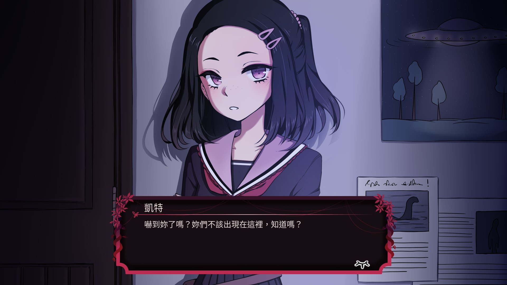

# Project Kat - Paper Lily Prologue 繁體中文翻譯

## 遊戲網址
https://store.steampowered.com/app/1698960/Project_Kat__Paper_Lily_Prologue/
https://leef6010.itch.io/projectkat

## 安裝方式

1. 到 https://github.com/nh60211as/Project-Kat-zh-TW-Translation/releases 下載最新翻譯包
2. 將翻譯包放置於遊戲的 pack 資料夾下
3. 開啟遊戲(第一次會偵測到有新的翻譯包而自動關閉遊戲，這是正常現象)
4. 再次開啟遊戲並到 Settings > Game Settings > Language 切換至繁體中文

## 使用資源

* 遊戲內字體：  
[Noto Sans Traditional Chinese](https://fonts.google.com/noto/specimen/Noto+Sans+TC)  
修改後的[怨霊](http://www.ankokukoubou.com/font/onryou.htm) (由於此字體被禁止重新發布，因此本 repo 不包含此字體檔案、或是為此翻譯包修改後的字體檔案)

* 遊戲圖片使用字體：
[清松手寫體5p](https://github.com/jasonhandwriting/JasonHandwriting)

## 產生翻譯包方式

請參考： https://docs.google.com/document/d/1EvIIyEhHKRcq4UExLn-JIEYvh65HKF7CawheY4srLog/edit

注意事項： 此 repo 所需的"怨霊"字體需自行下載，而且此字體不包含"妳"這個文字，這會導致遊戲內部分文字缺漏。若要自行產生可正常運作的翻譯包請自行從該字體中加入所需缺漏文字或是使用沒有缺字的字體。

## 遊戲擷圖

